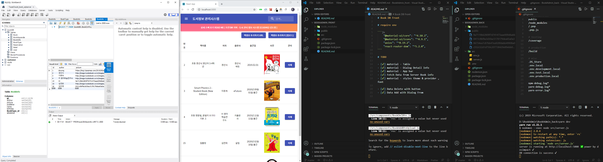
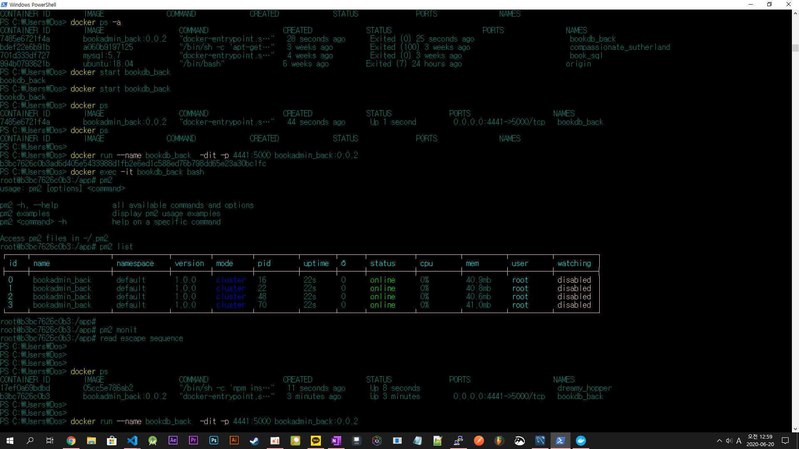

# Book DB Front




# require env

```js
    "@material-ui/core": "^4.10.2",
    "@material-ui/icons": "^4.9.1",
    "axios": "^0.19.2",
    "react-router-dom": "^5.2.0",
```

# TODO

- [✔] material - Table
- [✔] material - Dialog Detail Info
- [✔] material - App bar
- [✔] Fetch Data from Server Book info
- [✔] material - styles theme & providor , font

- [✔] Data Delete with button
- [✔] Data Add with Dialog From

# Docker Devops

- STEP1 .dockerignore

```js
node_modules;
public.dockerignore;
Dockerfile;
Dockerfile.prod;
```

- STEP2 DockerFile

```js
FROM node:carbon

RUN mkdir -p /app
WORKDIR /app
ADD ./ /app

ENV NODE_ENV=production
ENV PATH /app/node_modules/.bin:$PATH
COPY package.json /app/package.json

RUN npm install --silent
RUN npm install react-scripts@3.4.1 -g


EXPOSE 3000
#CMD pm2 start ./src/server.js -i max
CMD npm start
```

- STEP4 build docker file

```
docker build -t bookadmin_react:1.0.0 .
```

- STEP5 execution docker image

```
docker run --name bookadmin_front_server -itd -p 4441:5000 bookadmin_react:1.0.0

```

- STEP6 check container and monit

```
docker run --name bookadmin_front_server -itd -p 4441:5000 bookadmin_react:1.0.0
docker attach -it bookadmin_front_server bash

```
